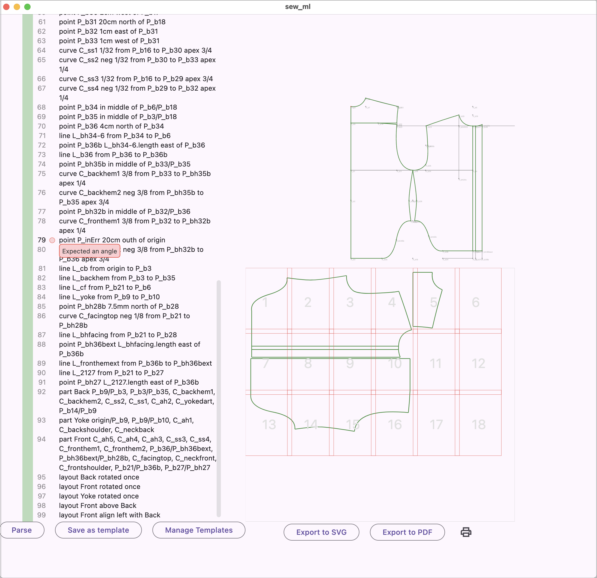

# SewML

SewML is a human-readable language for describing sewing patterns, akin to the instruction lists you can find in tailoring books.

You can use it to create patterns, share them, play around, etc.

### Example

To draw a simple square of 10cm by 10cm, you could use the following instructions:
```
point P_1 10cm east of origin
point P_2 10cm north of P_1
point P_3 10cm north of origin
line L_1 from origin to P_1
line L_2 from P_1 to P_2
line L_3 from P_2 to P_3
line L_4 from P_3 to origin
```
This illustrates how SewML works:

- each line is a command to create a new object
- you can currently define the following objects: points, lines, curves, measurements, parts and layouts (examples follow below)
- for each object, you specify a label (P_1, L_1, etc) so you can refer to it in subsequent commands

---

### Differences with tailoring books
You can't simply copy-paste some text from a tailoring book. Some translation of the drawing commands is required.

__1. Directions__
\
In classic tailoring books, you would get instructions like these:

```
0-1 scye depth plus 4cm.
0-2 natural waist length plus 3cm.
0-3 shirt length plus 8cm.
```
And this would be accompanied by a drawing of the finished pattern. When following the instructions, you constantly refer to the drawing to know which direction these points and lines go in. In SewML we need to be more specific and provide the direction of one point relative to existing points. E.g.
```
measurement M_scye_depth 18cm
measurement M_natural_waist_length 30cm
measurement M_shirt_length 50cm
point P_1 M_scye_depth + 40 south of origin
point P_2 M_natural_waist_length + 30 south of origin
point P_3 M_shirt_length + 80 south of origin
line L_1 from origin to P_3
```
__2. Square across__
\
In tailoring books, you might find an instruction to "square across" from a point on a line, i.e. draw a line perpendicular to another line. 
\
In SewML, all lines need a start point and an end point, so we don't allow a "square across" instruction that would produce an infinite line. But it's pretty easy to translate to SewML parlance using north, east, west, etc.
\
```
0-1 scye depth plus 4cm.
1-2 square off chest width from 1
```
would become
```
measurement M_scye_depth 18cm
measurement M_chest_width 50cm
point P_1 M_scye_depth + 40 south of origin
line L_1 from origin to P_1
point P_2 M_chest_width east of P_1
line L_2 as P_1/P_2
```
For a complete example, refer to the included templates for Aldrich's classic shirt and sleeve. These templates include the original instructions from Aldrich's books in comments.

---

### UI
SewML currently has a viewer and the language library rolled into one (we'll split them later).




### Complete Syntax

See [Syntax.md](/Syntax.md) or look at the tests in [grammar_test.dart](test/grammar_test.dart)

### Future developments
more line definitions, e.g. parallel to, adjacent from, etc\
slash-and-spread, folds, darts\
export to freesewing.org code, ...\
smarter object creation, e.g. P_1.y, R_1.bottomleft, L_1.parallel, etc
