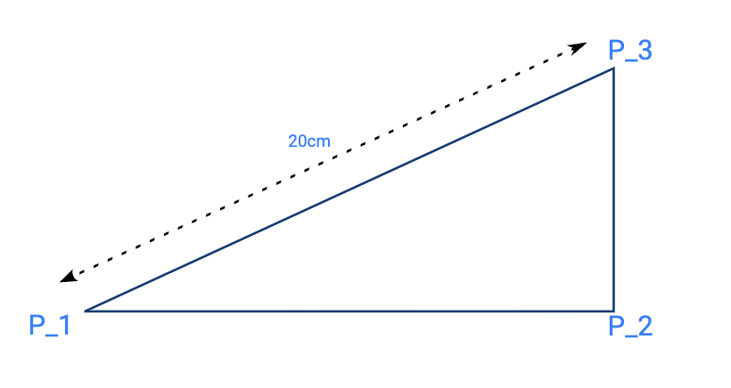

### Comments

You can include comments by starting the line with a hashtag.\
E.g.
```
# comment line that doesn't affect the drawing
```

### Exec

You can play a template - one of the built-in ones or one you created yourself with the exec command.\
E.g.
```
exec aldrich_classic_shirt
```

### Measurements

Define measurements to use in your drawing as follows.

```
measurement M_chest-circumference 20cm
measurement M_chest-ease 25mm
measurement M_half-chest (M_chest-circumference / 2) + (M_chest-ease / 4)
```
\
**Note**: although you can define measurements in cm, mm, or inches, they are always returned in mm.
```
measurement M_chest-circumference 20cm
measurement M_chest-with-ease M_chest-circumference + 2      <- this will add up to 20.2cm
measurement M_chest-with-ease M_chest-circumference + 20     <- this will add up to 22cm
measurement M_chest-with-ease M_chest-circumference + 20mm   <- this will add up to 22cm
measurement M_chest-with-ease M_chest-circumference + 2cm    <- this will add up to 22cm
```
\
**Note**: if you play a template using **exec**, you can override any measurements in the template by defining the measurement before calling the template. For example, to get the Aldrich classic shirt in your own measurements, so something like this:
```
measurement M_scye 30cm
measurement M_waist_length 47cm
measurement M_shirt_length 73cm
measurement M_chest 106cm
measurement M_neck 42cm
measurement M_back 41cm
exec aldrich_classic_shirt
```

### Points

Points are always defined relative to other points or lines and should always start with 'P_'.\
***Note***: if you plan on creating templates, it is always a good idea to prefix point names to prevent name clashes
There is one built-in point named 'origin'.\
\
You can use wind-directions (north, east, west, south, norhteast, northwest, etc) or general directions (left of, right of, up from, down from, etc)
```
point P_1 20cm north of origin
point P_1 M_chest-circumference left of origin
point P_1 M_chest-circumference + 20 down from origin
```
\
You can specify angles using 'at angle' in degrees or radians.
```
point P_1 20cm at angle 45deg from origin
point P_1 20cm at angle 3.14rad from origin
```
\
You can create a point on the intersection of existing lines.\
***Note***: in the second example, the notation P_2/P_3 or P_4/P_5 creates temporary lines which are not drawn.
```
point P_1 on intersection of L_1 and L_2
point P_1 on intersection of P_2/P_3 and P_4/P_5
```
\
You can create points in the middle of a line, or a fraction of the line distance from the start point of the line.
```
point P_1 in the middle of L_1
point P_1 in the middle of P_2/P_3
point P_1 fraction 1/4 on L_1
point P_1 fraction 1/4 of L_1
```
\
You can use a bit of geometry to get an adjacent side from a hypothenuse and opposite side (e.g. to draw shoulder slopes or sleeve crown slopes)
```
point P_1 as adjacent west of P_2 with hypotenuse 10cm from P_3
```
This defines a right-angled triangle with P_2/P_3 as opposite side. Given the hypotenuse of 20cm (e.g. a front armhole length or a shoulder width) it finds out where P_1 will be west if P_2.



### Lines

Lines are simply defined by a start and end point
```
line L_1 as P_1/P_2
line L_1 from P_1 to P_2
```

### Curves

To define a curve, you specify a start and end point. The curvature is specified as a fraction of the length between these points.
```
curve C_1 1/8 from P_1 to P_2
```


If you want the curve to bend to the other side, use 'neg'
```
curve C_1 neg 1/8 from P_1 to P_2
```

To make the curve bend left or right, use an apex fraction
```
curve C_1 1/8 from P_1 to P_2 apex 1/4
```


### Parts

You define parts such as sleeves, front, back, cuffs, yokes, collars, etc by listing the points, lines and curves that make up the part
```
part sleeve P_1,L_1,L_2,C_1,...
```

### Layout

With a layout, you can define how different parts are layed out on a page (which can then be exported to SVG or PDF). There is one layout per drawing. 

Add parts to the layout as follows:
```
layout sleeve
layout back
```

By default, parts are added the way they were initially drawn, but you can rotate them of flip them over the x and y axis
```
layout yoke rotated once
layout sleeve rotated twice flipped over x
layout back rotated thrice flipped over xy
```

You can also arrange the parts relative to each other
```
layout yoke to the right of back
layout sleeve above back
layout sleeve align left with back
layout front align top with yoke
```
